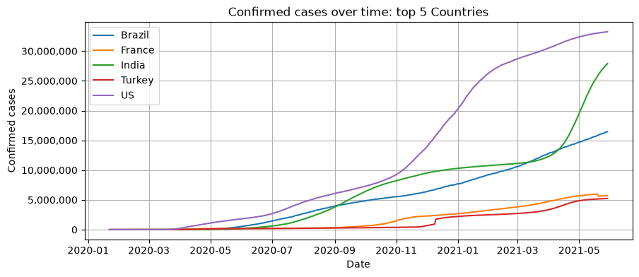
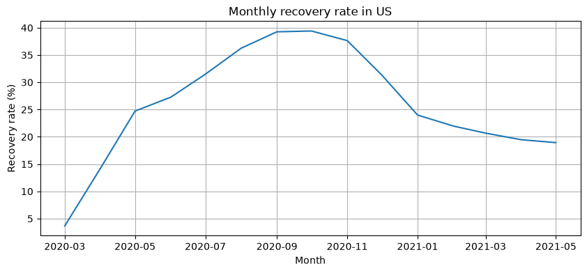

# COVID-19 Global Data Analysis

An exploratory data analysis project using COVID-19 time-series dataset (confirmed, deaths, and recovered cases across various Provinces from ~190 countries, Jan 2020–May 2021) to investigate the spread, progression, and impact of the pandemic across countries and regions.

**[View the full notebook with rendered output here.](#https://nbviewer.org/github/chetanchandel31/da-covid19/blob/main/notebooks/01_covid_19_analysis.ipynb?flush_cache=true)** 

## Questions Explored

The analysis investigates questions including:

- How did confirmed covid-19 cases evolve over time in China?
- How were confirmed cases distributed across Chinese provinces?
- Which countries had the highest number of confirmed cases?
- How did confirmed covid-19 cases evolve over time in top 5 countries?
- Which of Germany, France, and Italy saw the highest single-day surge in new cases, and when?
- How did recovery rates compare between Canada and Australia as of December 31, 2020?
- What were the highest and lowest death rates among Canadian provinces?
- Which countries had the highest total deaths overall?
- Which 5 countries experienced the highest average daily deaths?
- How did total deaths evolve over time in the United States?

- What were the monthly trends in confirmed cases, deaths, and recoveries globally?
- How did those monthly trends compare specifically for the US, Italy, and Brazil?
- Which countries had the highest average death rates during 2020?
- How did total recoveries compare with total deaths in South Africa?
- How did the recovery rate in the United States change month by month?

## Data Cleaning

The raw dataset required several cleaning and validation steps before analysis.

Key areas addressed included:

- **Inconsistent date string formats** - the raw date columns weren't uniformly formatted, so a direct `pd.to_datetime()` conversion wasn't reliable straight away. Had to normalize the date strings themselves first, then convert to proper `datetime` dtype.
- **Disguised nulls** - some rows used `(0, 0)` as a placeholder for missing coordinates, which is misleading since (0, 0) is a real point on a map. Replaced with actual nulls instead.
- **Cruise ships aren't countries** - entries like *Diamond Princess* and *MS Zaandam* are listed under `Country/Region` in the raw data but represent quarantined ships, not places. Didn't remove them for case-count analysis since they're real cases, but excluded from any geographic ranking or comparison - including once catching a case where a cruise ship's tiny sample size produced a mathematically valid but meaningless 100% death rate.
- **Discontinued reporting, disguised as real data** - several countries' cumulative recovered-case counts dropped to exactly 0 mid-series when a country simply stopped reporting. This produced impossible results (e.g. a -5M single-month change). Verified the pattern was real (not a one-off) before fixing it via forward-fill, and made sure any values still `0` *after* the fix genuinely represent legitimate 0 cases(usually from initial dates) rather than a reporting gap
- **Context-aware province imputation** - a null `Province/State` didn't always mean the same thing. Countries with only a single row (no province-level breakdown at all) had their null imputed as `"All Provinces"`. Countries that already had multiple named province rows *plus* one null row were imputed as `"Unknown Province(s)"` instead, since filling those with `"All Provinces"` would imply they contain the case count for the other named Province rows.

These checks were important because the dataset contains real-world reporting behavior that cannot always be handled correctly by blindly filling or removing values.

## Data Transformation

The original datasets are provided in a wide format, with individual dates represented as columns.

The data was transformed into long format containing:

- `Province/State`
- `Country/Region`
- `Lat`
- `Long`
- `Date`
- `confirmed_cases`
- `death_cases`
- `recovered_cases`

The transformed datasets were then aggregated at the country/date level and merged to create a combined dataset containing confirmed cases, deaths, and recoveries for each country and date.

Additional transformations, most notably `.diff()`-based "new case" columns computed on temporary frames - supported later analysis, including:

- Daily new case calculations
- Monthly aggregations
- Death and recovery rates
- Country-level comparisons
- Province-level comparisons
- Time-series analysis

## Visualizations

The project uses Python visualization libraries to explore trends and comparisons, including:

- Line charts for time-series analysis
- Bar charts for country and province comparisons
- Tree-maps for comparing total deaths across countries
- Stacked area charts for province-level trends

Visualizations are accompanied by short observations highlighting notable patterns and anomalies in the data.


## Key findings

- China's outbreak was primarily concentrated in Hubei (which contains Wuhan city, the pandemic's epicenter) - this province alone consisted the vast majority of the country's confirmed cases. The growth across all provinces seemed to flatten sharply after the initial spike in early 2020.
- US led highest total confirmed cases throughout the given time series, with its sharpest rise in late 2020–early 2021. India and Brazil exchanged second place multiple times rather than one consistently outpacing the other. Despite being the pandemic's origin, China didn't even rank in the top 5 by mid-2021.
  
- Canada showed some variation in reported death rates across provinces and territories, with Quebec having the highest observed death rate at 3.01%. Cruise-ship and repatriation entries, although appearing as Canada's Provinces in the dataset, were excluded when identifying the lowest rate among actual provinces and territories.
- Yemen, Sudan, and Italy had the highest average death rates among countries in 2020, likely factors include testing coverage, healthcare capacity, and how consistently cases were confirmed and reported.
- South Africa's recoveries outnumbered deaths by roughly 27:1, indicating most confirmed cases resulted in recovery.
- US's recovery ratio peaked around **39%** in October 2020 before *reported* recovery data trailed off around Dec 2020 due to discontinued state-level reporting, a dataset limitation, not an actual outcome decline.
  

## Tech Stack

Python, Pandas, Matplotlib, Seaborn, Plotly, Jupyter, [uv](https://github.com/astral-sh/uv), VS Code.

## Project structure
 
```
da-covid19/
├── assets/                          # chart images embedded in this README
├── data/
│   └── raw/
│       └── covid_19_dataset.xlsx
├── notebooks/
│   └── 01_covid_19_analysis.ipynb
├── pyproject.toml
├── uv.lock
└── README.md
```

Data loads from the local file by default, if it's not found (e.g. running outside a full clone or on google collab), it falls back to fetching the raw data file directly from this repo's raw GitHub URL.

## Running it locally
 
```bash
git clone https://github.com/chetanchandel31/da-covid19.git
cd da-covid19
uv sync
```
The project uses `uv` for Python dependency and environment management.

The notebook can be opened and executed using Jupyter or the Jupyter extension in VS Code. Open `notebooks/01_covid_19_analysis.ipynb` and run all cells.

